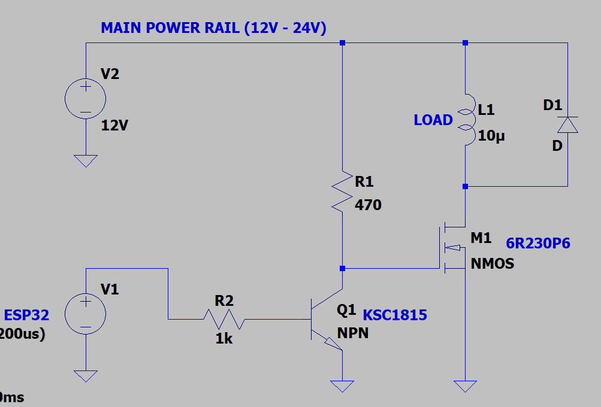

# BHR Speed Controller

A motor speed controller firmware for ESP32-based CYD (Cheap Yellow Display) board. Controls a 12V DC motor with PWM output and optional RPM feedback for PID control.

## Application



## Hardware Requirements

- **CYD Board**: ESP32-2432S028 (ESP32 with ST7789 240x320 TFT display and XPT2046 touchscreen)
- **Motor**: 12V DC motor
- **Driver**: MOSFET or motor driver connected to GPIO 18 (PID_OUTPUT)
- **RPM Sensor** (optional): Connected to GPIO 27 (RPM_INPUT)

## Features

### Control Modes

1. **Fixed Power Mode**: Maintains constant PWM duty cycle regardless of load
   - User sets target power percentage (0-100%)
   - Motor runs at fixed power output
   
2. **PID Control Mode**: Maintains target RPM using feedback control
   - Requires RPM sensor connection
   - Automatically adjusts power to maintain desired speed
   - Falls back to fixed power if RPM sensor not enabled

### Configuration Options

- **Target Power**: 0-100% (adjustable in 5% increments)
- **Target RPM**: 0-5000 RPM (adjustable in 50 RPM increments)
- **Soft Start**: 5 seconds (default) - gradually ramps up power/speed
- **Timeout**: Configurable auto-shutoff after set duration
- **PID Parameters**: Kp=0.5, Ki=0.1, Kd=0.01 (adjustable in code)

### User Interface

The touchscreen displays:
- **Current Mode**: Fixed Power or PID Control
- **Motor State**: STOPPED, STARTING, or RUNNING
- **Current Power**: Real-time power output percentage
- **Current RPM**: Live RPM reading (if sensor enabled)
- **Target Power**: Desired power level
- **Target RPM**: Desired speed (in PID mode)

### Touch Controls

- **START/STOP Button** (Green/Red): Start or stop the motor
- **Mode Button** (Blue): Toggle between Fixed Power and PID modes
- **Power +/- Buttons** (Cyan): Adjust target power
- **RPM +/- Buttons** (Magenta): Adjust target RPM
- **SLEEP Button** (Orange): Enter deep sleep mode to save battery

### Power Management

The device supports deep sleep mode for battery-powered operation:
- **Deep Sleep**: Tap the SLEEP button (top right) to enter low-power sleep mode
- **Wake Up**: Press the **BOOT button** (labeled BOOT on CYD) to wake the device
- **Power Consumption**: 
  - Active: ~100-200mA (display on)
  - Deep Sleep: ~10-150μA (99.9% power savings)
- **Motor Safety**: Motor automatically stops before entering sleep mode

## Pin Configuration

Configured in [platformio.ini](platformio.ini):

```ini
PID_OUTPUT = 18    # PWM output to motor driver (25kHz, 8-bit)
RPM_INPUT = 27     # RPM sensor input (falling edge trigger)
```

Display and touch pins are pre-configured for CYD hardware.

## Building and Uploading

1. Install [PlatformIO](https://platformio.org/)
2. Open project folder in VS Code with PlatformIO extension
3. Build: `pio run`
4. Upload: `pio run --target upload`
5. Monitor serial output: `pio device monitor`

## Usage

1. **Power On**: Device initializes and displays UI
2. **Set Mode**: Tap "Mode" button to select Fixed Power or PID Control
3. **Adjust Target**: 
   - Use Power +/- buttons to set target power
   - Use RPM +/- buttons to set target RPM (PID mode)
4. **Start Motor**: Tap green "START" button
5. **Monitor**: Watch real-time power and RPM readings
6. **Stop Motor**: Tap red "STOP" button

## Soft Start

When motor starts, power gradually increases over the configured soft start period (default 5 seconds):
- **Fixed Power Mode**: Power ramps from 0% to target power
- **PID Mode**: Target RPM ramps from 0 to target RPM

This reduces mechanical stress and current spikes.

## Timeout Feature

Configure automatic motor shutoff:
```cpp
g_state.config.timeoutMinutes = 30;  // Auto-stop after 30 minutes
```

Set to 0 to disable timeout.

## RPM Sensor

The firmware expects **1 pulse per revolution** on the RPM_INPUT pin:
- Uses falling edge interrupt detection
- Calculates RPM every 100ms
- Assumes motor stopped if no pulses for 2 seconds
- Enable/disable: `g_state.config.rpmSensorEnabled = true/false`

## PID Tuning

Default PID parameters in [global_state.h](include/global_state.h):
```cpp
cfg.pidKp = 0.5f;   // Proportional gain
cfg.pidKi = 0.1f;   // Integral gain
cfg.pidKd = 0.01f;  // Derivative gain
```

Adjust these values based on your motor characteristics:
- Increase Kp for faster response (may cause oscillation)
- Increase Ki to eliminate steady-state error
- Increase Kd to reduce overshoot

## File Structure

```
include/
  ├── global_state.h     # State management and configuration
  ├── pid_controller.h   # PID controller interface
  ├── display.h          # Display and UI functions
  ├── touch.h            # Touch input handling
  └── motor_control.h    # Motor PWM and RPM measurement

src/
  ├── main.cpp           # Main program logic
  ├── pid_controller.cpp # PID implementation
  ├── display.cpp        # TFT display rendering
  ├── touch.cpp          # Touch event processing
  └── motor_control.cpp  # Motor control and RPM sensing
```

## Safety Notes

- Motor driver must handle 12V and appropriate current for your motor
- Ensure proper heat sinking for MOSFET/driver
- Use flyback diode across motor terminals
- Consider current limiting in driver circuit
- Test with low power settings first

## Troubleshooting

**Motor doesn't start:**
- Check MOSFET/driver connection to GPIO 18
- Verify power supply to motor driver
- Check motor connections
- Monitor serial output for debug messages

**RPM reading is 0:**
- Verify RPM sensor connection to GPIO 27
- Check sensor is generating pulses (use oscilloscope)
- Ensure `rpmSensorEnabled` is true
- Verify sensor output is 3.3V compatible

**Touch not responding:**
- Calibrate touch by adjusting `TS_MIN_X`, `TS_MAX_X`, `TS_MIN_Y`, `TS_MAX_Y` in touch.cpp
- Check touchscreen connections
- Try different rotation setting

**PID oscillation:**
- Reduce Kp value
- Increase soft start time
- Adjust PID gains incrementally

## License

Open source - modify as needed for your application.
